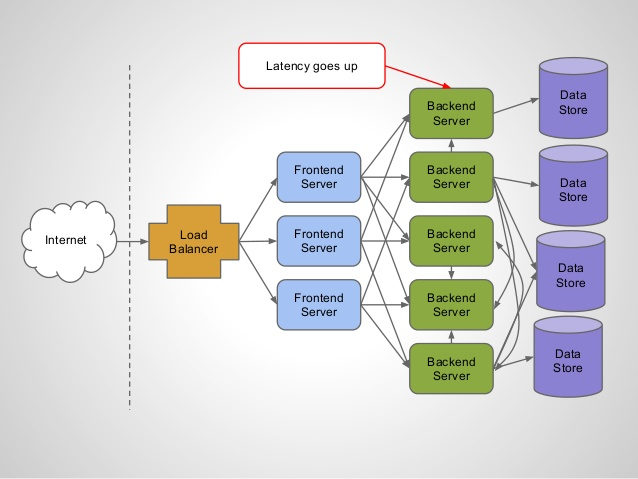
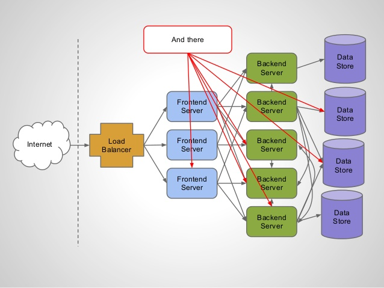

# Introduction in the Playframework

## Threaded vs Evented
Inspired by [Play Framework: async I/O without the thread pool and callback hell](http://engineering.linkedin.com/play/play-framework-async-io-without-thread-pool-and-callback-hell)

In a threaded world downstream latency may escalate:

Boom!!!

[Taken from slideshare brikis98](http://www.slideshare.net/brikis98/play-framework-async-io-with-java-and-scala/19)

The greatest challenge is the right scaling of the thread pool, which depends on the actual number of incoming requests and therefore is highly dynamic.

One possible answer to this problem is event-driven with not blocking IO, which are the underlaying concepts of [Play](https://www.playframework.com/)
TODO graphics etc...

## Basic Play Samples

- [Scala-Sample](./play-scala): Work in Progress
- [Java-Sample](./play-java): TBD

The samples start from the Typesafe Reactor project seeds:

- [Scala Seed](https://www.typesafe.com/activator/template/play-scala-reactive-platform-15v01)
    - [Sources](https://github.com/playframework/playframework/tree/master/templates/play-scala)
- [Java Seed](https://www.typesafe.com/activator/template/play-java-reactive-platform-15v01)
    - [Sources](https://github.com/playframework/playframework/tree/master/templates/play-java)

They show/demonstrate

- The basic seeds/skeletons
- WebService Calls
    - synchronous/blocking vs.
    - asynchronous (Futures/Promises)
- the relation between Lists and Futures
    - map, flatMap ...
    - Future Errorhandling
...

